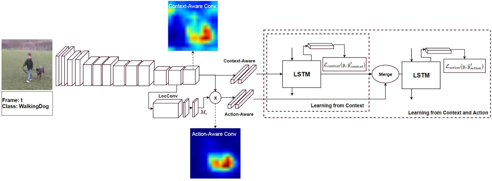

# Multi Stage LSTM (MS-LSTM) for Action Anticipation

#### Implementation of "Encoraging LSTMs to Anticipate Actions Very Early", ICCV 2017 <br/>
[Encouraging LSTMs To Anticipation Actions Very Early, ICCV 2017](http://openaccess.thecvf.com/content_ICCV_2017/papers/Aliakbarian_Encouraging_LSTMs_to_ICCV_2017_paper.pdf)

---
## Abstract
In contrast to the widely studied problem of recognizing an action given a complete sequence, action anticipation aims to identify the action from only partially available videos. As such, it is therefore key to the success of computer vision applications requiring to react as early as possible, such as autonomous navigation. In this paper, we propose a new action anticipation method that achieves high prediction accuracy even in the presence of a very small percentage of a video sequence. To this end, we develop a multi-stage LSTM architecture that leverages context-aware and action-aware features, and introduce a novel loss function that encourages the model to predict the correct class as early as possible. Our experiments on standard benchmark datasets evidence the benefits of our approach; We outperform the state-of-the-art action anticipation methods
for early prediction by a relative increase in accuracy of 22.0% on JHMDB-21, 14.0% on UT-Interaction and 49.9% on UCF-101.



---
#### Citation
If you are using our code, please cite
```
@InProceedings{Aliakbarian_2017_ICCV,
author = {Sadegh Aliakbarian, Mohammad and Sadat Saleh, Fatemeh and Salzmann, Mathieu and Fernando, Basura and Petersson, Lars and Andersson, Lars},
title = {Encouraging LSTMs to Anticipate Actions Very Early},
booktitle = {The IEEE International Conference on Computer Vision (ICCV)},
month = {Oct},
year = {2017}
} 

@article{aliakbarian2016deep,
  title={Deep action-and context-aware sequence learning for activity recognition and anticipation},
  author={Aliakbarian, Mohammad Sadegh and Saleh, Fatemehsadat and Fernando, Basura and Salzmann, Mathieu and Petersson, Lars and Andersson, Lars},
  journal={arXiv preprint arXiv:1611.05520},
  year={2016}
}
```


---
#### Contact
For any question, bug report, and etc., please contact Sadegh Aliakbarian (PhD Student at Australian National Unviersity, Researcher at CSIRO and ACRV), mohammadsadegh.aliakbarian@data61.csiro.au 
